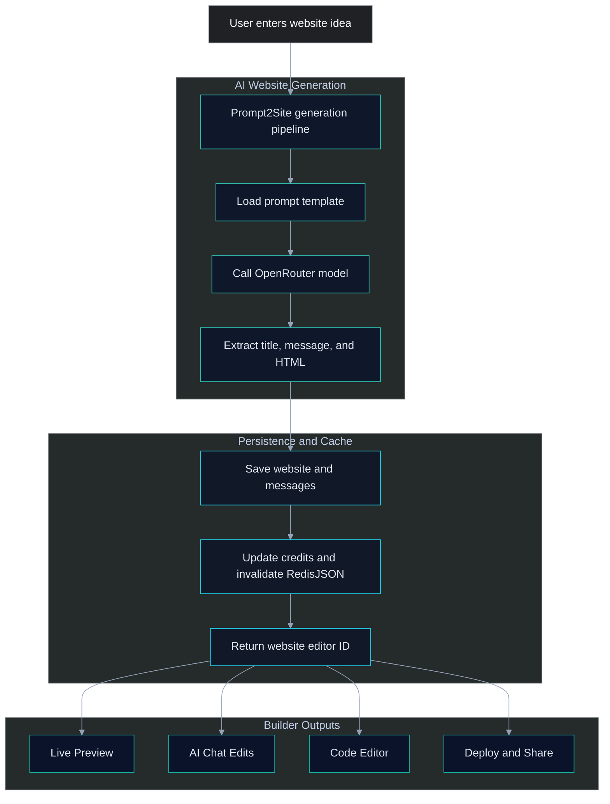
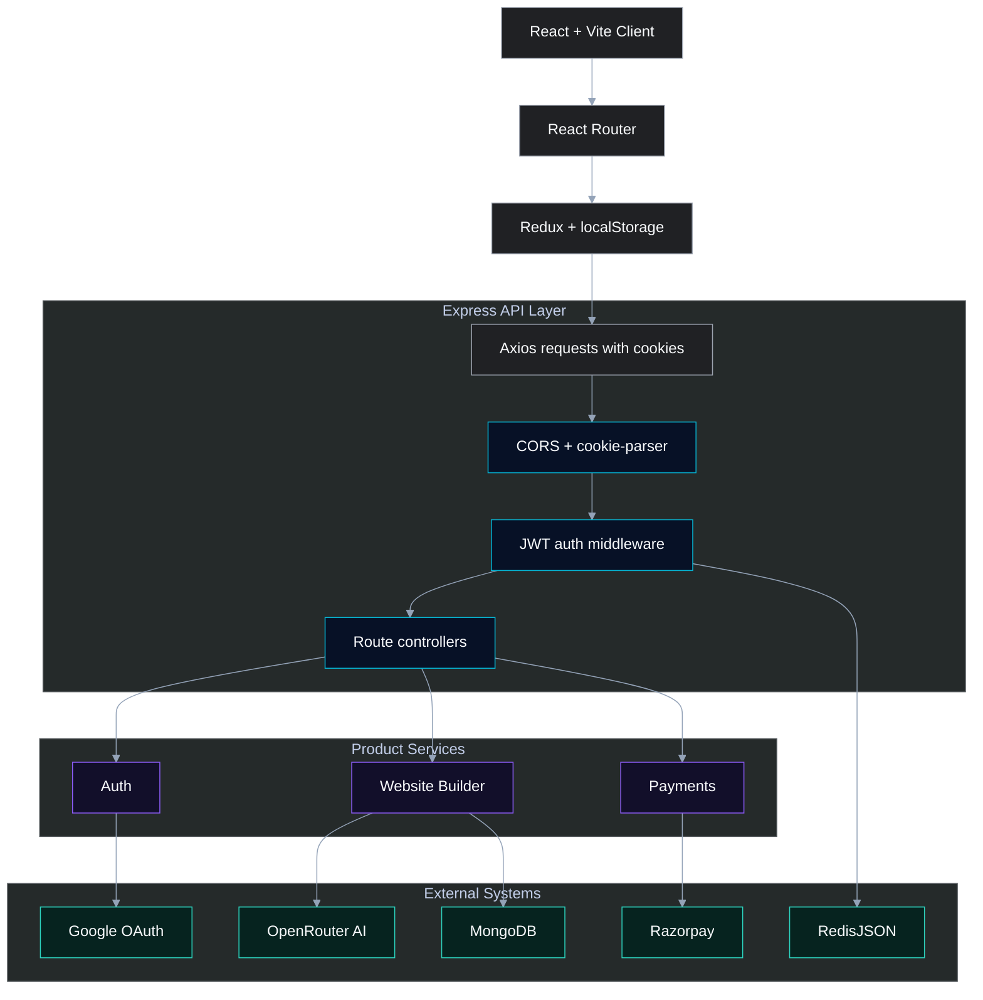
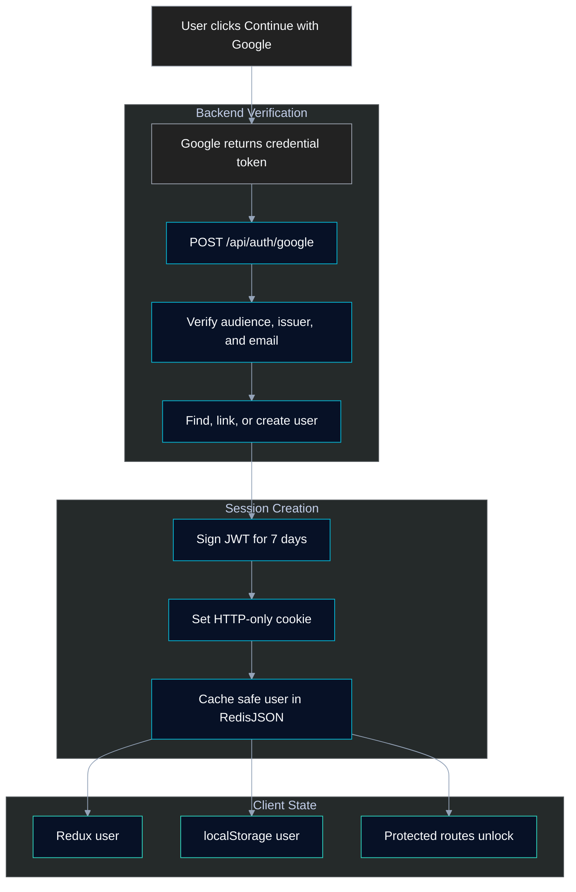
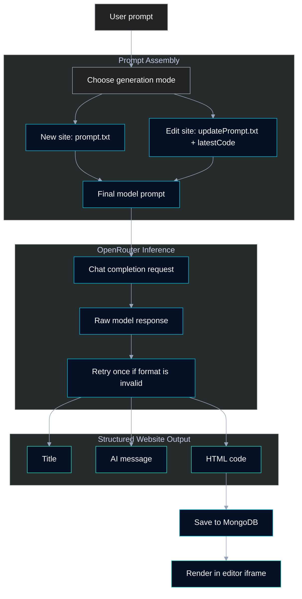
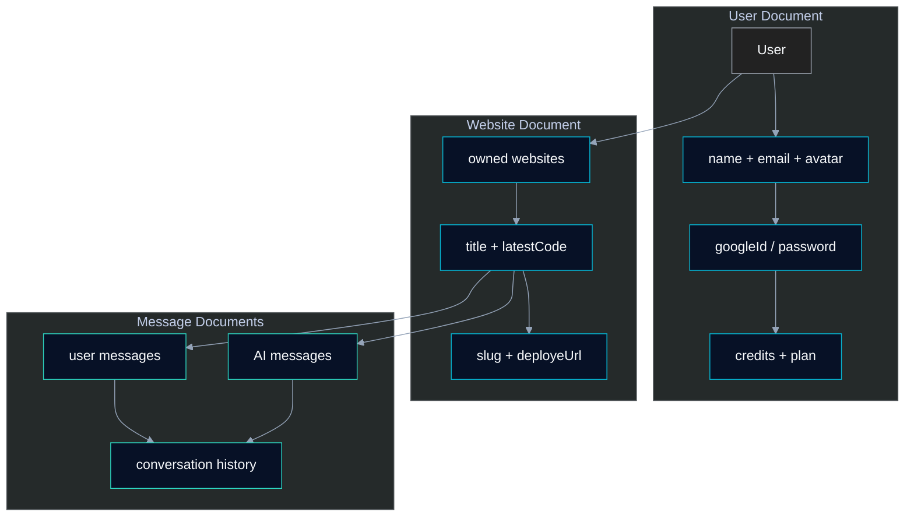

<p align="center">
  
</p>

<p align="center">
  
</p>

<p align="center">
  
  
  
  
  
</p>

<p align="center">
  
  
  
  
</p>

---

## Why This Project

**Prompt2Site** turns a plain-language idea into a working, responsive HTML website with AI.

Instead of starting from an empty editor, users can:

- Generate a complete website from a prompt
- Preview the result instantly in a sandboxed iframe
- Refine the site through chat-style AI edits
- Feel the product through ReactBits-inspired motion, particles, and shiny text
- Inspect and edit generated HTML with Monaco Editor
- Save generated websites to a private dashboard
- Buy credits through Razorpay
- Share generated pages through deployed site URLs

> Built to solve: "How can creators move from website idea to usable, editable prototype faster?"

---

## Feature Highlights

| Feature | What it does |
| :---: | :--- |
| Prompt Website Generation | Sends a user prompt to OpenRouter and creates a saved HTML website |
| AI Change Requests | Updates an existing website using the current code plus a new prompt |
| Live Preview | Renders generated HTML inside a sandboxed iframe |
| Code Editor | Opens generated HTML in Monaco Editor for inspection and manual tweaks |
| Dashboard | Shows saved website cards with iframe thumbnails |
| Deploy / Share | Creates a slug and shareable site URL |
| Google Login | Verifies Google ID tokens on the backend and issues a JWT cookie |
| Credit System | Deducts credits for generation and website updates |
| Razorpay Payments | Creates orders and verifies payment signatures before adding credits |
| RedisJSON Cache | Caches users, website lists, website details, and slug lookups for 2 days |

---

## Animated Flow



---

## Tech Stack

<p align="center">
  
</p>

<p align="center">
  
  
  
</p>

<table align="center">
  <tr>
    <th align="center" width="22%">Domain</th>
    <th align="center">Stack</th>
    <th align="center" width="25%">Purpose</th>
  </tr>
  <tr>
    <td align="center"><strong>Frontend UI</strong></td>
    <td align="center">
      
      
      
      
      
      
    </td>
    <td align="center">Responsive, animated website builder interface with ReactBits-style effects</td>
  </tr>
  <tr>
    <td align="center"><strong>Editor UX</strong></td>
    <td align="center">
      
      
      
    </td>
    <td align="center">Code view, preview controls, particles, and tool actions</td>
  </tr>
  <tr>
    <td align="center"><strong>Backend API</strong></td>
    <td align="center">
      
      
      
      
    </td>
    <td align="center">Routing, auth, AI orchestration, and payment verification</td>
  </tr>
  <tr>
    <td align="center"><strong>Data Layer</strong></td>
    <td align="center">
      
      
      
    </td>
    <td align="center">Users, websites, messages, and cached hot reads</td>
  </tr>
  <tr>
    <td align="center"><strong>AI + Payments</strong></td>
    <td align="center">
      
      
      
    </td>
    <td align="center">Website generation, sign-in, checkout, and credit updates</td>
  </tr>
</table>

---

## Architecture



---

## Authentication Flow



### Auth Notes

| Area | Implementation |
| :---: | :--- |
| Login UI | `@react-oauth/google` |
| Token verification | `google-auth-library` on backend |
| Session transport | JWT in HTTP-only cookie named `token` |
| Protected APIs | `/api/user`, `/api/website`, `/api/payment` |
| Password support | Backend supports bcrypt signup/signin endpoints |
| Not implemented | GitHub OAuth, refresh tokens |

---

## API Surface

| Group | Method | Endpoint | Purpose |
| :---: | :---: | :--- | :--- |
| Auth | `POST` | `/api/auth/google` | Google login, user creation/linking, JWT cookie |
| Auth | `GET` | `/api/auth/logout` | Clear cookie |
| User | `GET` | `/api/user/profile` | Return authenticated user |
| Website | `POST` | `/api/website/generate` | Generate website from prompt |
| Website | `GET` | `/api/website/websiteData/:id` | Fetch website with conversations |
| Website | `POST` | `/api/website/changeWebsite/:id` | Update generated website with AI |
| Website | `GET` | `/api/website/getAll` | Fetch user's saved websites |
| Website | `GET` | `/api/website/deploy/:id` | Create deployed share URL |
| Website | `GET` | `/api/website/getBySlug/:slug` | Fetch latest HTML by slug |
| Website | `DELETE` | `/api/website/delete/:id` | Delete website and messages |
| Payment | `POST` | `/api/payment/createOrder` | Create Razorpay order |
| Payment | `POST` | `/api/payment/verifyPayment` | Verify signature and add credits |

---

## AI Pipeline



| Detail | Current implementation |
| :---: | :--- |
| Provider | OpenRouter-compatible chat completions endpoint |
| Model | Controlled by `MODEL` env variable |
| Parser | Extracts `TITLE`, `MESSAGE`, and fenced HTML |
| Retry | Re-prompts once with stricter formatting if parsing fails |
| Streaming | Not implemented |
| Vector DB / RAG | Not implemented |
| Background jobs | Not implemented |

---

## RedisJSON Cache

Prompt2Site uses the official `redis` package and RedisJSON commands.

```js
await redisClient.json.get(key);
await redisClient.json.set(key, "$", value);
await redisClient.expire(key, 172800);
```

| Key | Value | TTL | Invalidated when |
| :--- | :---: | :---: | :--- |
| `prompt2site:user:{userId}` | Safe user profile | 2 days | auth, credit changes, generation, update |
| `prompt2site:websites:list:{userId}` | Dashboard site list | 2 days | generate, update, delete, deploy |
| `prompt2site:website:detail:{userId}:{websiteId}` | Website detail + conversations | 2 days | update, delete, deploy |
| `prompt2site:website:slug:{userId}:{slug}` | Latest HTML for slug route | 2 days | update, delete, deploy |

If Redis is missing or down, the app logs the issue and falls back to MongoDB.

---

## Database Model



---

## Project Structure

```mermaid
%%{init: {'theme': 'base', 'themeVariables': { 'background': '#0b0f19', 'primaryColor': '#0f172a', 'primaryTextColor': '#e2e8f0', 'primaryBorderColor': '#22d3ee', 'lineColor': '#94a3b8', 'clusterBkg': '#252a2a', 'clusterBorder': '#52575a', 'fontFamily': 'Inter, ui-sans-serif, system-ui' }}}%%
flowchart TD
  ROOT["prompt2site"]

  subgraph CLIENT["client - React Experience"]
    direction TB
    C1["src/app - Redux store"]
    C2["src/components - UI + animation"]
    C3["src/pages - product screens"]
    C4["src/hooks - auth + payments"]
    C5["router.jsx - route guard"]
  end

  subgraph SERVER["server - Express API"]
    direction TB
    S1["asset - AI prompt templates"]
    S2["config - DB, Redis, OpenRouter"]
    S3["controllers - request logic"]
    S4["models - Mongo schemas"]
    S5["routes + middleware + services"]
  end

  ROOT --> CLIENT
  ROOT --> SERVER
  ROOT --> DOCS["README + LICENSE"]

  classDef root fill:#202124,stroke:#9ca3af,color:#f8fafc,stroke-width:1px;
  classDef client fill:#071126,stroke:#06b6d4,color:#f8fafc,stroke-width:1px;
  classDef server fill:#120f2a,stroke:#8b5cf6,color:#f8fafc,stroke-width:1px;
  classDef docs fill:#06231f,stroke:#2dd4bf,color:#f8fafc,stroke-width:1px;

  class ROOT root;
  class C1,C2,C3,C4,C5 client;
  class S1,S2,S3,S4,S5 server;
  class DOCS docs;
```



---

## Quick Start

### 1. Clone

```bash
git clone https://github.com/ParthPipermintwala/prompt2site.git
cd prompt2site
```

### 2. Backend

```bash
cd server
npm install
npm start
```

### 3. Frontend

```bash
cd client
npm install
npm run dev
```

Open `http://localhost:5173`.

---

## Environment Variables

### Backend `.env`

| Variable | Purpose |
| :---: | :--- |
| `PORT` | Backend port |
| `ORIGIN` | Allowed frontend origin and share URL base |
| `JWT_SECRET` | JWT signing secret |
| `MONGODB_URL` | MongoDB connection string |
| `GOOGLE_CLIENT_ID` | Google OAuth backend verification |
| `GOOGLE_CLIENT_SECRET` | Google OAuth secret |
| `OPENROUTER_API_KEY` | OpenRouter API key |
| `OPENROUTER_URL` | OpenRouter chat completions endpoint |
| `MODEL` | Model used for generation |
| `RAZORPAY_KEY_ID` | Razorpay server key |
| `RAZORPAY_KEY_SECRET` | Razorpay signature verification secret |
| `REDIS_URL` | Redis URL with RedisJSON support |

### Frontend `.env`

| Variable | Purpose |
| :---: | :--- |
| `VITE_BACKEND_URL` | Express API base URL |
| `VITE_GOOGLE_CLIENT_ID` | Google OAuth browser client ID |
| `VITE_RAZORPAY_KEY_ID` | Razorpay checkout key |

> Keep secret keys on the backend. `VITE_` variables are exposed to the browser.

---

## Demo Sequence

1. Login with Google
2. Enter a website idea
3. Wait for AI generation
4. Open the generated website in the editor
5. Ask for changes in chat
6. Inspect HTML in Monaco Editor
7. Deploy and copy the share link
8. Buy more credits through Razorpay

---

## Security and Performance

| Area | Current implementation |
| :---: | :--- |
| Auth protection | JWT cookie middleware on user, website, and payment APIs |
| Cookie settings | `httpOnly`, `sameSite: "lax"`, local `secure: false` |
| Passwords | bcrypt hashing for email/password auth |
| OAuth | Backend validates Google token issuer, audience, and verified email |
| Payments | Razorpay HMAC signature verification |
| Query performance | `.lean()` on read-heavy MongoDB queries |
| Cache performance | RedisJSON read-through cache with 2-day TTL |
| Preview isolation | Generated HTML renders inside sandboxed iframes |

## Created By

<p align="center">

</p>
<p align="center">
  <a href="https://github.com/ParthPipermintwala">
    
  </a>
  
  
</p>

---

## License

Prompt2Site is released under the [MIT License](LICENSE).

<p align="center">
  
  
</p>

<p align="center">
  
</p>
